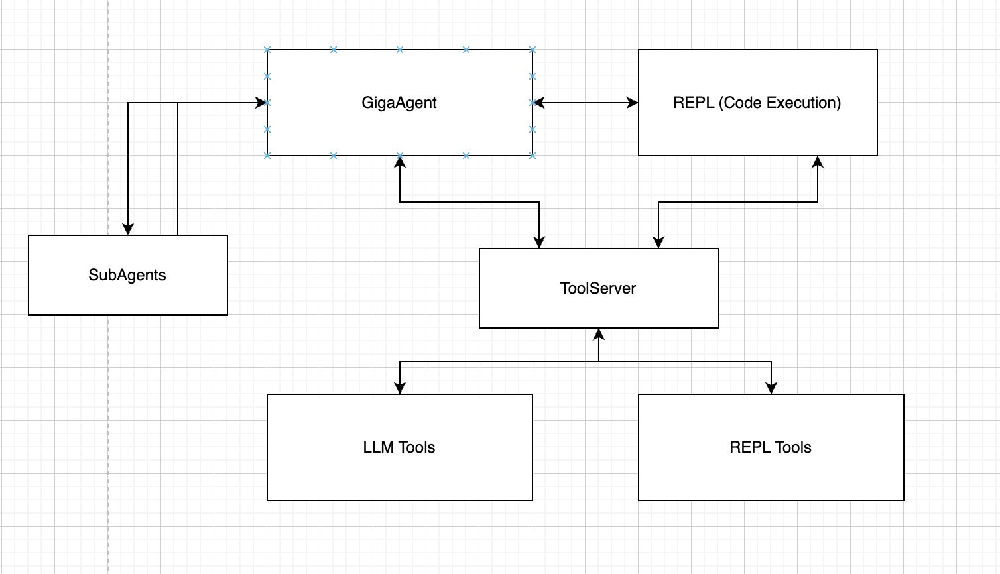

# GigaAgent
Универсальный агент-оркестратор, который объединяет REPL, внешние инструменты и субагентов для решения самых разных задач.

Что умеет GigaAgent:

-  Работает с разными LLM (GigaChat, ChatGPT, Anthropic и остальные которые есть в фреймворке LangChain)
-  REPL-среда для запуска кода прямо в чате (jupyter-like)
-  Интеграция с внешними сервисами: VK, GitHub, 2GIS, OpenWeatherMap и др.
-  Инструменты для анализа данных, генерации изображений, мемов, создания презентаций и лендингов
-  Поддержка нескольких провайдеров для генерации картинок (GigaChat, FusionBrain, OpenAI)
-  Гибкая настройка через Docker и .env — запускайте локально или разверните у себя в облаке

**Важно:** Это **ранняя-alpha** версия проекта *примера универсального агента*, которая трансформировалась в Open-Source проект из тестового стенда. Вы можете встретить баги, ошибки, неточности. Ваш компьютер может взбунтоваться, послать вас и пойти делать презентации с помощью своего под-агента "Создателя презентаций" на фриланс. **YOU HAVE BEEN WARNED**

Прочитать описание под-агентов и найти примеры их работы можно: [здесь](SUBAGENTS.md)

По-смотреть остальные примеры работы можно: [здесь](EXAMPLES.md)

**Демо:**

## Схема работы

- **GigaAgent** — основной агент
- **REPL** — отдельный контейнер, который может выполнять код в jupyter-like среде, написанный LLM
- **ToolServer** — сервер, исполняющий инструменты подключенные к LLM или закрытый код (или код завязанный на секретных env переменных), который мы не хотим шарить пользователю в REPL среде.
- **LLM Tools** — инструменты LLM (поиск, работа с данными ВК, работа с гитхабом и т.д.)
- **REPL Tools** — инструменты REPL (*predict_sentiments*, *get_embeddings*, *summarize* + инструменты LLM). Эти методы могут быть вызваны из REPL и завязаны на LLM API. Мы не хотим, чтобы пользователь в среде REPL, мог получить ключи с доступами к API
- **SubAgents** — под-агенты, выполняющие узко-направленные задачи. (Создание презентаций, Создание лендингов и т.д.)

## Шаблоны .env переменных
Вы можете взять пред-настроенные .env / .docker.env файлы под определенных провайдеров здесь:
- [GigaChat](env_examples/gigachat)
- [OpenAI](env_examples/openai)

## Выбор LLM / Embeddings
Выбор LLM осуществляется через env переменные `GIGA_AGENT_LLM` и `GIGA_AGENT_LLM_FAST`.
* **GIGA_AGENT_LLM** — основная LLM, на которой работает основные агенты.
* **GIGA_AGENT_LLM_FAST** — дешевая / быстрая LLM, на которой происходить скрейпинг ссылок и вызов LLM через REPL среду.

Выбор происходит на основе метода LangChain [init_chat_model](https://python.langchain.com/api_reference/langchain/chat_models/langchain.chat_models.base.init_chat_model.html).
с небольшой правкой возможности выбора GigaChat в качестве основной LLM.

В проект предустановлены библиотеки для работы GigaChat, OpenAI. Для работы остальных LLM вам нужно будет поставить их в папке `backend/graph` с помощью `uv add`

Пример заполнения:
* `GIGA_AGENT_LLM="gigachat:GigaChat-2-Max"` — для выбора модели GigaChat-2-Max в качестве основной
* `GIGA_AGENT_LLM="openai:gpt-4o"` — для выбора модели gpt-4o в качестве основной

По такому же принципу выбираются модель эмбедингов `GIGA_AGENT_EMBEDDINGS`.

Также в проекте есть простая модель для оценки настроения текста на основе эмбендингов LLM с помощью `GIGA_AGENT_SENTIMENT_MODEL`. 
Допустим это можно применять для анализа настроений комментариев.
Модели созданы на основе GigaChat модели `EmbeddingsGigaR` и модели OpenAI `text-embedding-3-small`. 
Создать свою мини модель под конкретную модель можно в ноутбуке [sentiment_model.ipynb](backend/graph/giga_agent/repl_tools/models/sentiment_model.ipynb)

## Генерация изображений
Агент может генерировать изображения. Для этого нужно заполнить ENV переменную: `IMAGE_GEN_NAME`. `IMAGE_GEN_NAME` заполняется в формате `провайдер:название_модели`

Тулы/агенты, которые зависят от генерации изображений: **generate_image**, **create_meme**, **create_landing**, **generate_presentation**.
Если не заполнить `IMAGE_GEN_NAME`, эти тулы отключатся.

### Провайдеры
#### GigaChat Kandinsky
Генерация изображений на GigaChat API `/image/generate/`. Доступ к этому API пока работает по приглашению.
Чтобы включить этот способ, заполните: `IMAGE_GEN_NAME="gigachat:kandinsky-4.1""`
#### FusionBrain
Генерация изображений с помощью сервиса [FusionBrain](https://fusionbrain.ai/docs/). Он предоставляет 100 бесплатных генераций. 

Чтобы включить этот способ, заполните: `IMAGE_GEN_NAME="fusion_brain:123""`. Заметьте, что модель можно заполнить как угодно, в этом провайдере будет использоваться всегда Kandinsky3.0

Также нужно заполнить следующие ENV
- **KANDINSKY_API_KEY** — API ключ Fusion Brain
- **KANDINSKY_SECRET_KEY** — API secret Fusion Brain
#### OpenAI
Генерация изображений с помощью [OpenAI](https://platform.openai.com/docs/guides/image-generation?image-generation-model=gpt-image-1)

Чтобы включить этот способ, заполните: `IMAGE_GEN_NAME="openai:dall-e-3""`

Также нужно заполнить следующие ENV
- **OPENAI_API_KEY**

## Комментарии по поводу доп. ENV переменных
* `REPL_FROM_MESSAGE` — ставьте `0` если код в REPL будет браться из аргумента функции. `1` — если код берется из сообщения. Иногда GigaChat не может нормально прописывать сложный код в аргументе функции.
* `MAIN_GIGACHAT_*` — пропишите настройки подключения GigaChat как в примерах [отсюда](env_examples/gigachat); Это настройка основной LLM, которая крутится в главном графе. Настройки, которые начинаются не с MAIN_ идут в под-агенты. Возможно в будущем уберем.

## Запуск (через Docker)
1. `pip install langgraph-cli`
2. `make init_files`
3. Заполнить .docker.env в корне проекта
4. `make build_graph`
5. `docker compose up -d`
6. Проект запущен на http://localhost:8502

**Обновление**: При обновлении репозитория начинайте с шага 3

## Локальный запуск
Для локального запуска желательно иметь следующие свободные порты: **2024**, **8811**, **9090**, **9092**, **3000**

Также должен быть поставлен [uv](https://docs.astral.sh/uv/)

Если освободить эти порты нельзя, то поправьте .env переменные: 
1. make init_files
2. Заполнить .env в корне проекта
3. Запуск REPL
   * `cd backend/repl`
   * `uv sync`
   * `make run`
4. Запуск Upload Server на REPL
   * `cd backend/repl`
   * `make run_u`
5. Запуск ToolServer
   * `cd backend/graph`
   * `uv sync`
   * `make run_tool_server`
6. Запуск LangGraph
   * `cd backend/graph`
   * `make run_graph`
7. Запуск frontend
   * `cd front`
   * `make dev`

## Внешние сервисы
GigaAgent подключен к внешним сервисам, поэтому для корректной работы некоторых сценариев нужно получить их API ключи.

Если не заполнить API-ключ сервиса, то тулы, которые зависят от него, отключатся от LLM.
Также можно отключить тулы/агентов в файле [config](backend/graph/giga_agent/config.py) в переменных **SERVICE_TOOLS**/**AGENTS**/**TOOLS**

Ниже ссылки и инструкции к сервисам
### Tavily (поиск в интернете)
Тулы/агенты, которые зависят от сервиса: **search**, **get_urls**

Также в агентах **city_explore** и **lean_canvas** применяется поиск, но он не обязателен. Если вы не заполните API-ключ, то они все равно смогут корректно отработать.

Получить API ключ можно здесь: https://tavily.com/

### GitHub
Тулы/агенты, которые зависят от сервиса: **get_workflow_runs**, **list_pull_requests**, **get_pull_request**

Получить API ключ можно здесь: https://github.com/settings/personal-access-tokens

### VK
Тулы/агенты, которые зависят от сервиса: **vk_get_posts**, **vk_get_comments**, **vk_get_last_comments**

Для работы с ВК нужно создать мини-приложение, здесь: https://dev.vk.com/ru/admin/apps-list.
И получить сервисный API-ключ от приложения.

### 2GIS
Тулы/агенты, которые зависят от сервиса: **city_explore**

https://docs.2gis.com/ru/platform-manager/overview

### SaluteSpeech (синтез голоса)
Тулы/агенты, которые зависят от сервиса: **podcast_generate**

https://developers.sber.ru/portal/products/smartspeech

### OpenWeatherMap (получение погоды)
Тулы/агенты, которые зависят от сервиса: **weather**

https://openweathermap.org/api/one-call-3

## Roadmap
- [ ] Перевод документации / примеров
- [ ] Оптимизировать генерацию изображений в агенте презентаций, лендингов
- [ ] Поддержка MCP
- [ ] Добавить историю чатов
- [ ] Перенести настройку агента с ENV переменных в единый понятный config файл
- [ ] Вынести наименование агентов и узлов их выполнения в бэкенд из файла [config.ts](front/src/config.ts)
- [ ] Добавить поддержку разных провайдеров синтеза речи (OpenAI, ElevenLabs)
- [ ] Добавить память
- [ ] Добавить авторизацию
- [ ] Тесты
- [ ] Сделать локализацию интерфейса + (возможно промптов)
- [ ] Агент по созданию сайтов 2.0 (также добавить в него подгрузку созданных графиков / изображений как в агенте презентаций)
- [ ] To be continued...

### Будем рады вашим PR / Issues!