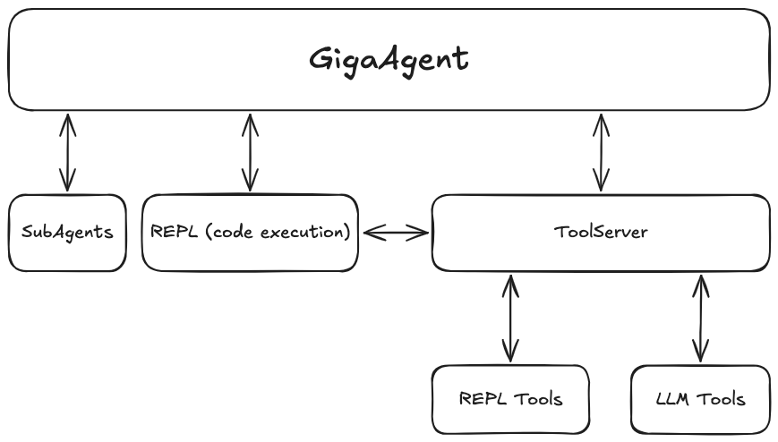

# GigaAgent

GigaAgent — это агент-оркестратор, который может решать самые разные задачи.
Например, он может [придумать мем](docs/examples/memes/chat.pdf), [описать бизнес-модель стартапа](docs/examples/lean_canvas/lean_canvas.pdf) или [создать лендинг](docs/examples/changelog_landing/changelog_landing.pdf).
Для этого GigaAgent использует субагентов, REPL-среду для исполнения кода и сторонние сервисы.

GigaAgent разработан в рамках проекта [GigaChain](https://github.com/ai-forever/gigachain) - открытого набора инструментов для разработки LLM приложений.

> [!CAUTION]
> GigaAgent может писать и исполнять код без участия пользователя.
> Учитывая раннюю стадию разработки проекта это может быть опасно.
> Используйте агента с большой осторожностью.

GigaAgent умеет:

- работать с разными моделями, [доступными в LangChain](https://python.langchain.com/docs/integrations/chat/#all-chat-models): GigaChat, ChatGPT, Anthropic и другими;
- исполнять код в чате с помощью в REPL-среды, подобной [блокнотам Jupyter](https://jupyter.org/);
- обмениваться данными со сторонними сервисами: VK, GitHub, 2GIS и другими;
- использовать инструменты для анализа данных, генерации изображений, создания презентаций и лендингов;
- генерировать изображения с помощью разных провайдеров: GigaChat, FusionBrain, OpenAI;
- работать локально или в облаке, с помощью Docker. 

## Демо


Примеры работы с GigaAgent в формате PDF:

- [кластеризация комментариев в VK](docs/examples/cluster_comments/clusters_ru.pdf);
- [анализ настроений комментариев в VK и вывод основных жалоб](docs/examples/sentiment_analysis/sentiment_analysis.pdf);
- [создание сайта со списком изменений, созданным на основе последних закрытых PR](docs/examples/changelog_landing/changelog_landing.pdf).

Примеры работы субагентов, а также подробная информация о них — в разделе [Субагенты](SUBAGENTS.md).

## Быстрый старт

Вы можете запустить GigaAgent как Docker-приложение или по отдельности инициализировать каждый из компонентов агента.

> [!TIP]
> Смотрите также подробные инструкции по запуску GigaAgent на Cloud.ru:
> * [руководство](CLOUD_RU_SETUP.md);
> * [видео на RuTube](https://rutube.ru/video/c9a416a654723f0b1df23424bd3d9b4d/);
> * [видео на YouTube](https://youtu.be/tyeXgCJ090Y?si=WcbITF3DiTo_aBUF).

### Запуск в Docker

Перед запуском в Docker:

* Установите [LangGraph CLI](https://pypi.org/project/langgraph-cli/):

   ```sh
   pip install langgraph-cli
   ```

* Скопируйте мок-данные в папку `files` в корне проекта:

  ```sh
  make init_files
  ```

Чтобы запустить GigaAgent:

1. В корне проекта заполните файл `.docker.env` с переменными окружения.

   Примеры заполнения `.docker.env` — в папке [`env_examples`](env_examples/README.md).

2. Соберите Docker-образ сервера LangGraph:
   
   ```sh
   make build_graph
   ```
3. Запустите приложение:

   ```sh
   docker compose up -d
   ```

   Для запуска контейнера с LangGraph-сервером может понадобиться API-ключ для доступа к LangSmith.

Приложение будет доступно в браузере по адресу `http://localhost:8502`.

Чтобы применить изменения после обновления репозитория:

1. Остановите приложение.
2. Повторно выполните шаги инструкции.

### Локальный запуск отдельных компонентов

Перед запуском:

* Убедитесь, что у вас свободны порты 2024, 8811, 9090, 9092, 3000.
* [Установите менеджер пакетов uv](https://docs.astral.sh/uv/getting-started/installation/).
* [Установите менеджер пакетов npm](https://docs.npmjs.com/downloading-and-installing-node-js-and-npm).
* Скопируйте мок-данные в папку `files` в корне проекта:

  ```sh
  make init_files
  ```

Чтобы локально запустить компоненты GigaAgent: 

1. В корне проекта заполните файл `.env` с переменными окружения.

   Примеры заполнения `.env` — в папке [`env_examples`](env_examples/README.md).

2. Запустите REPL-среду и Upload Server:

   ```sh
   cd backend/repl
   uv sync
   make run
   make run_u
   ```

4. Запустите ToolServer и сервер LangGraph:

   ```sh
   cd backend/graph
   uv sync
   make run_tool_server
   make run_graph
   ```

5. Запустите фронтенд приложения:

   ```sh
   cd front
   npm install
   make dev
   ```

Приложение будет доступно в браузере.

## Настройка параметров

### Переменные окружения

Переменные окружения для работы GigaAgent задаются в файлах `.env` или `.docker.env ` в корне проекта.
В папке [env_examples](env_examples/README.md) вы найдете шаблоны файлов с переменными окружения, для работы с разными LLM-сервисами.

Обратите внимание на переменные `REPL_FROM_MESSAGE` и `MAIN_GIGACHAT_*`.

* `REPL_FROM_MESSAGE` — ставьте `0` если код в REPL будет браться из аргумента функции. `1` — если код берется из сообщения. Иногда GigaChat не может нормально прописывать сложный код в аргументе функции.
* `MAIN_GIGACHAT_*` — пропишите настройки подключения GigaChat как в примерах [отсюда](env_examples/gigachat); Это настройка основной LLM, которая крутится в главном графе. Настройки, которые начинаются не с MAIN_ идут в под-агенты. Возможно в будущем уберем.

### Выбор моделей для генерации и эмбеддингов

Модели задаются с помощью переменных окружения:

* **GIGA_AGENT_LLM** — основная LLM, на которой работает основные агенты.
* **GIGA_AGENT_LLM_FAST** — дешевая / быстрая LLM, на которой происходить скрейпинг ссылок и вызов LLM через REPL среду.

Выбор происходит на основе метода LangChain [init_chat_model](https://python.langchain.com/api_reference/langchain/chat_models/langchain.chat_models.base.init_chat_model.html).
С небольшой правкой возможности выбора GigaChat в качестве основной LLM.

В проект предустановлены библиотеки для работы GigaChat, OpenAI. Для работы остальных LLM вам нужно будет поставить их в папке `backend/graph` с помощью `uv add`

Пример заполнения:

* `GIGA_AGENT_LLM="gigachat:GigaChat-2-Max"` — для выбора модели GigaChat-2-Max в качестве основной
* `GIGA_AGENT_LLM="openai:gpt-4o"` — для выбора модели gpt-4o в качестве основной

По такому же принципу выбирается модель для векторного представления текстов `GIGA_AGENT_EMBEDDINGS`.

Также в проекте есть простая модель для оценки настроения текста на основе эмбеддингов LLM с помощью `GIGA_AGENT_SENTIMENT_MODEL`. 
Допустим это можно применять для анализа настроений комментариев.
Модели созданы на основе GigaChat модели `EmbeddingsGigaR` и модели OpenAI `text-embedding-3-small`. 
Создать свою мини модель под конкретную модель можно в ноутбуке [sentiment_model.ipynb](backend/graph/giga_agent/repl_tools/models/sentiment_model.ipynb)

### Создание изображений

Агент может генерировать изображения. Для этого нужно заполнить ENV переменную: `IMAGE_GEN_NAME`. `IMAGE_GEN_NAME` заполняется в формате `провайдер:название_модели`

Тулы/агенты, которые зависят от генерации изображений: **generate_image**, **create_meme**, **create_landing**, **generate_presentation**.
Если не заполнить `IMAGE_GEN_NAME`, эти тулы отключатся.

#### GigaChat Kandinsky

Генерация изображений на GigaChat API `/image/generate/`. Доступ к этому API пока работает по приглашению.
Чтобы включить этот способ, заполните: `IMAGE_GEN_NAME="gigachat:kandinsky-4.1""`

#### FusionBrain

Генерация изображений с помощью сервиса [FusionBrain](https://fusionbrain.ai/docs/). Он предоставляет 100 бесплатных генераций. 

Чтобы включить этот способ, заполните: `IMAGE_GEN_NAME="fusion_brain:123""`. Заметьте, что модель можно заполнить как угодно, в этом провайдере будет использоваться всегда Kandinsky3.0

Также укажите переменные:

- **KANDINSKY_API_KEY** — API ключ Fusion Brain
- **KANDINSKY_SECRET_KEY** — API secret Fusion Brain

#### OpenAI

Генерация изображений с помощью [OpenAI](https://platform.openai.com/docs/guides/image-generation?image-generation-model=gpt-image-1)

Чтобы включить этот способ, заполните: `IMAGE_GEN_NAME="openai:dall-e-3""`

Также нужно заполнить следующие ENV
- **OPENAI_API_KEY**

### Подключение сторонних сервисов

GigaAgent подключен к сторонним сервисам, поэтому для корректной работы некоторых сценариев нужно получить их API ключи.

Если не заполнить API-ключ сервиса, то тулы, которые зависят от него, отключатся от LLM.
Также можно отключить тулы/агентов в файле [config](backend/graph/giga_agent/config.py) в переменных **SERVICE_TOOLS**/**AGENTS**/**TOOLS**

Ниже ссылки и инструкции к сервисам

#### Tavily (поиск в интернете)

Тулы/агенты, которые зависят от сервиса: **search**, **get_urls**

Также в агентах **city_explore** и **lean_canvas** применяется поиск, но он не обязателен. Если вы не заполните API-ключ, то они все равно смогут корректно отработать.

Получить API ключ можно здесь: https://tavily.com/

#### GitHub

Тулы/агенты, которые зависят от сервиса: **get_workflow_runs**, **list_pull_requests**, **get_pull_request**

Получить API ключ можно здесь: https://github.com/settings/personal-access-tokens

#### VK

Тулы/агенты, которые зависят от сервиса: **vk_get_posts**, **vk_get_comments**, **vk_get_last_comments**

Для работы с ВК нужно создать мини-приложение, здесь: https://dev.vk.com/ru/admin/apps-list.
И получить сервисный API-ключ от приложения.

#### 2GIS

Тулы/агенты, которые зависят от сервиса: **city_explore**

https://docs.2gis.com/ru/platform-manager/overview

#### SaluteSpeech (синтез голоса)

Тулы/агенты, которые зависят от сервиса: **podcast_generate**

https://developers.sber.ru/portal/products/smartspeech

#### OpenWeatherMap (получение погоды)

Тулы/агенты, которые зависят от сервиса: **weather**

https://openweathermap.org/api/one-call-3

## Архитектура проекта



- **GigaAgent** — основной агент;
- **SubAgents** — субагенты, выполняющие специфические задачи: создание презентаций, создание лендингов и другие;
- **REPL** — отдельный контейнер с REPL-средой для выполнения кода, сгенерированного моделью;
- **ToolServer** — сервер, для запуска подключенных к моделям инструментов или выполнения закрытого код / кода завязанный на скрытых переменных окружения, который не доступен пользователю в REPL-среде.
- **LLM Tools** — инструменты (функции) для моделей: поиск, работа с данными ВК, работа с github и другие;
- **REPL Tools** — инструменты REPL: predict_sentiments, get_embeddings, summarize, инструменты моделей. Эти методы завязаны на API моделей и могут быть вызваны из REPL-среды. Они позволяют предотвратить доступ к API-ключам в REPL-среде.

## Планы

У нас много планов, но мы также будем рады вашим PR и Issues!

- [ ] Перевод документации / примеров
- [ ] Оптимизировать генерацию изображений в агенте презентаций, лендингов
- [ ] Поддержка MCP
- [ ] Добавить историю чатов
- [ ] Перенести настройку агента с ENV переменных в единый понятный config файл
- [ ] Вынести наименование агентов и узлов их выполнения в бэкенд из файла [config.ts](front/src/config.ts)
- [ ] Добавить поддержку разных провайдеров синтеза речи (OpenAI, ElevenLabs)
- [ ] Добавить память
- [ ] Добавить авторизацию
- [ ] Тесты
- [ ] Сделать локализацию интерфейса + (возможно промптов)
- [ ] Агент по созданию сайтов 2.0 (также добавить в него подгрузку созданных графиков / изображений как в агенте презентаций)
- [ ] To be continued...
